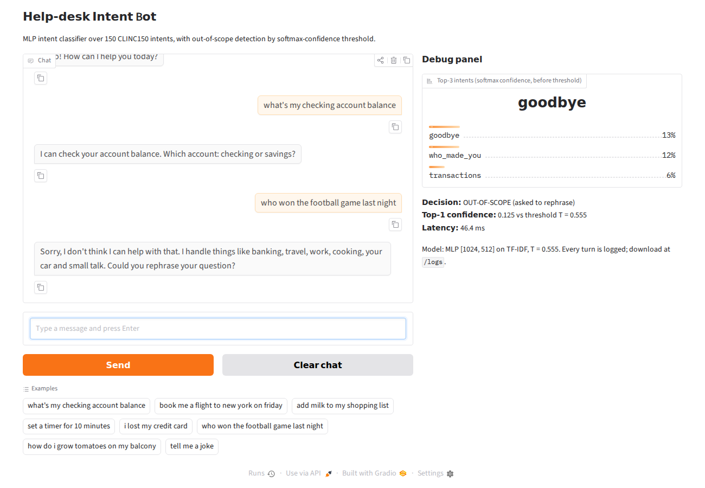
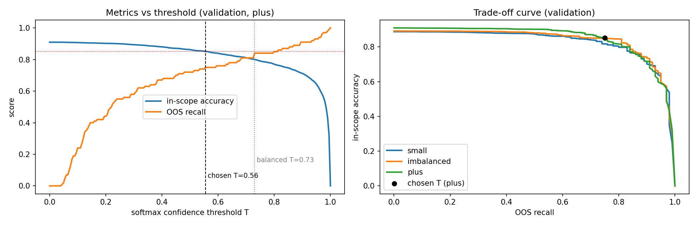

# P6. Intent-classifying help-desk chatbot with out-of-scope detection

**Team:** Afzal (Member A, model lead) and Shachi (Member B, application lead)

A text chatbot whose brain is an MLP intent classifier over the 150 intents of CLINC150. Queries whose top softmax confidence is below a threshold are treated as out-of-scope (OOS), and the bot asks the user to rephrase.



## Results (test set, evaluated once)

| Model | Train config | In-scope accuracy | OOS recall at T | In-scope acc. at T |
|---|---|---|---|---|
| Perceptron (from scratch, averaged) | plus | 88.89% | 65.7% | 85.33% |
| **MLP 2x(1024, 512), BatchNorm, Dropout 0.5** | **plus** | **90.13%** | **80.0% (T = 0.555)** | **84.87%** |
| MLP | imbalanced | 89.47% | 71.3% (T = 0.445) | 85.73% |
| MLP | small | 88.80% | 65.5% (T = 0.315) | 86.33% |

Success criterion (MLP in-scope test accuracy >= 85%) is met. Full tables are in `results/` and the discussion is in Section 10 of the notebook.



## Repository structure

```
notebooks/NNDL_ENDSEM_PROJECT.ipynb   training, experiments and analysis (with outputs)
results/                              all tables (.csv) and figures (.png), sample chat log
app/app.py                            FastAPI inference API + Gradio chat UI (debug panel, logging)
app/artifacts/                        mlp.pt, tfidf.joblib, config.json, templates.json
app/make_templates.py                 reply template for each of the 150 intents
app/test_api.py                       API smoke test
app/requirements.txt, app/README.md   Hugging Face Space config
requirements.txt                      everything needed for training + app
```

## Method in one paragraph

Text is lower-cased and cleaned, then turned into TF-IDF features (unigrams + bigrams, 20k features, fit on the training split only). The baseline is a one-vs-rest multi-class perceptron written from scratch in NumPy (150 binary perceptrons, sparse updates, weight averaging). The main model is a PyTorch MLP (`Linear -> BatchNorm1d -> ReLU -> Dropout` per hidden layer), trained with cross-entropy, Adam and early stopping on validation accuracy. The classifier is trained on in-scope intents only. At inference, if the top softmax probability is below T, the query is rejected as OOS. T is chosen on validation as the largest OOS recall that keeps in-scope accuracy >= 85%. Fixed seed 42; train/validation/test are never mixed and the test set is used once per final model.

## How to run

### 1. Train (Google Colab, about 10 to 15 minutes on a T4 GPU)
1. Upload `notebooks/NNDL_ENDSEM_PROJECT.ipynb` to Colab, set Runtime > Change runtime type > T4 GPU.
2. Runtime > Run all. The data is loaded with `load_dataset("clinc/clinc_oos", ...)`; if the Hub is unreachable it falls back to the original CLINC GitHub release (same splits).
3. The notebook writes tables and plots to `results/` and the model to `app/artifacts/`.

### 2. Run the chatbot locally
```bash
pip install -r requirements.txt
python app/test_api.py     # smoke test
python app/app.py          # open http://localhost:7860
```

### 3. API
| Endpoint | Description |
|---|---|
| `POST /predict` `{"text": "...", "session_id": "optional"}` | intent, reply, `is_oos`, top-3 intents with confidences, threshold, latency |
| `GET /health` | model info and test metrics |
| `GET /logs` | download the conversation log (CSV) |
| `/` | Gradio chat UI; the UI calls `/predict` over HTTP |

```bash
curl -X POST localhost:7860/predict -H "content-type: application/json" -d '{"text":"what is my account balance"}'
```

Every turn is logged to `app/chat_log.csv` (timestamp, session, text, predicted intent, confidence, OOS flag, top-3, reply, latency). A sample is in `results/sample_chat_log.csv`.

### 4. Deploy to Hugging Face Spaces
1. Create a new Space, SDK: **Gradio**.
2. Upload everything inside `app/` (including `artifacts/`) to the root of the Space. `app/README.md` already has the Space configuration header.
3. The Space builds and starts on port 7860. Space storage resets on restart, so download `/logs` before recording the demo.

## Team roles
* **Afzal (Member A, model lead):** data pipeline, preprocessing, perceptron, MLP, experiments, ablation tables, error analysis.
* **Shachi (Member B, application lead):** inference API, Gradio UI and debug panel, logging, deployment.
* Both: report, and able to explain every line of the training code.

## Dataset
CLINC150 (Larson et al., 2019, "An Evaluation Dataset for Intent Classification and Out-of-Scope Prediction"), configs `small`, `imbalanced` and `plus`: https://huggingface.co/datasets/clinc/clinc_oos
